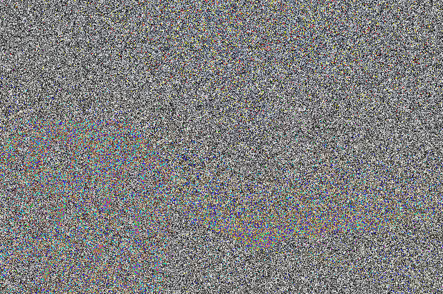

## Image-Encrypt
---

Requirements:
1. `Pillow`

How it works

1. User enters password, which is converted to initial seed value
2. Random number is generated based on that seed value
3. At each pixel, use these generated random numbers to assign RGB Values
4. Decrypt image using the same password

Usages:

Encryption

`python3 main.py -e <image_path> -p <password>`

`python3 main.py -encdir <dir_path> -p <password>`

Decryption

`python3 main.py -d <image_path> -p <password>`

`python3 main.py -decdir <dir_path> -p <password>`

You can use this tool to encrypt your image and can then store it in a cloud service, like Google Drive, Dropbox or OneDrive.

`WARNING: Please do not upload the encrypted image in services like free-tier Google Photos, where they compress your images`

The goal of the project was to edit an image to introduce noise/encrypt it, and then store it in [Google Photos](https://photos.google.com) for more privacy. But, I use the free/unlimited plan of Photos where Google compresses the uploaded image in JPEG format and then stores it cloud. As JPEG is lossy compression, It was not able to correctly produce the original image, maybe there is a way. Here is the original image, the encrypted image stored in Google Photos and the re-produced image.

I tried using [this](http://encrypt.imageonline.co/) image encryption tool, but it refused to decrypt the image i had downloaded from Google Photos.
### Google Photos Free Tier Plan

Original Image   | Encrypted Image | Decrypted Image
:---------------:|:---------------:|:---------------:
 |   | 

### Google Drive or OneDrive or Dropbox [ Tested ]

Original Image   | Encrypted Image | Decrypted Image
:---------------:|:---------------:|:---------------:
 |   | 

TODO
--- 
 - The software as of now overrides each pixel of the image, which i don't think is necessary
 - Add progress bar sort of thing while encrypting/decrypting the images in the directory

Also, the encrypted image has greater size then original image, and i don't know the actual reason for this yet, if you happen to know please let me know too.

`I was just having fun with random numbers so i don't exactly know how secure this implementation is, so please use it at your own risk. I doubt anyone may use this, but hey just in case`
